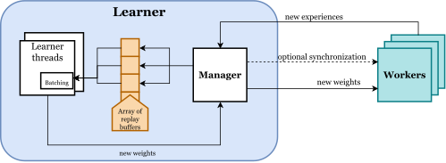
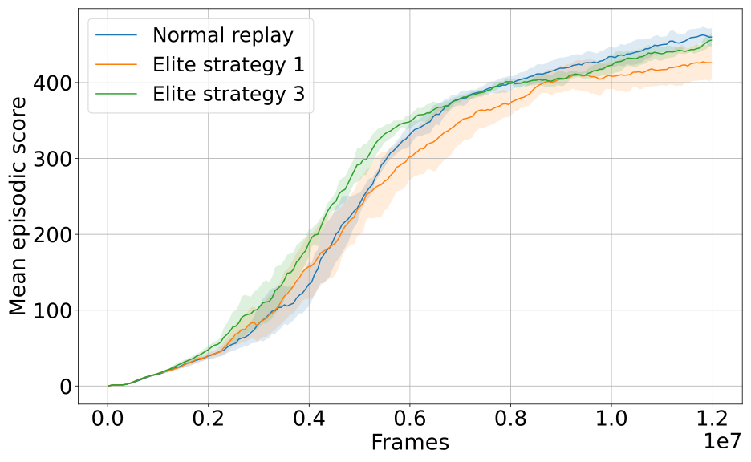
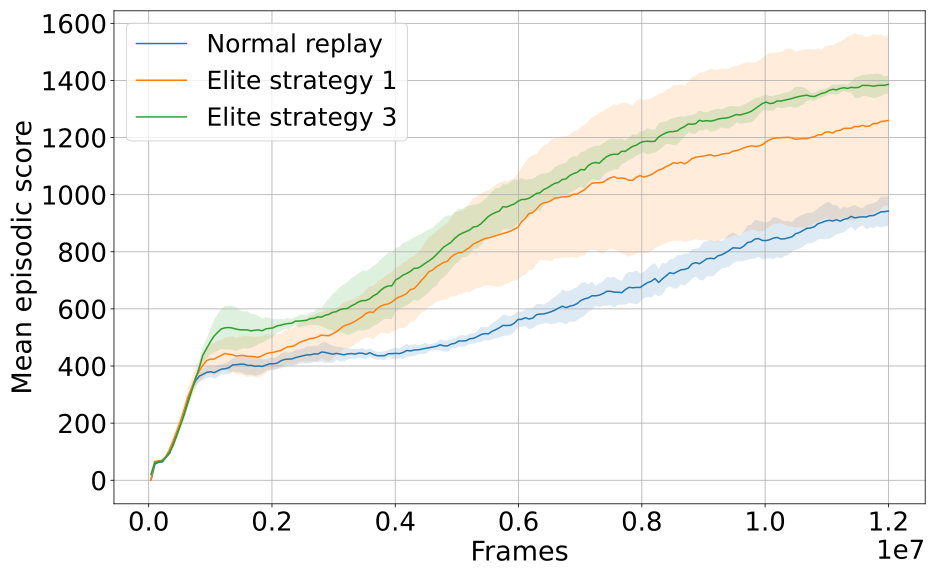

# PyTorch distributed RL platform
General distributed RL platform based on modified IMPALA architecture written in pure Python (>=3.8). It provides features
for training/testing/evaluating distributed RL agents on a single-node computational instance. Multi-node scaling is not supported.




Platform presently supports these agents:
- [Modified V-trace agent](https://arxiv.org/abs/1802.01561)
   - [CLEAR algorithm loss functions](https://arxiv.org/pdf/1811.11682.pdf)
   - [LASER algorithm behavioral relevance function - KL divergence](https://arxiv.org/pdf/1909.11583.pdf)


For mixing on/off-policy data these replay buffer methods are supported:
- Experience replay
- [Attentive experience replay](https://ojs.aaai.org/index.php/AAAI/article/view/6049/5905)
- Elite experience replay


Environment support:
- ALE environments


## Prerequisites
Before using the RL platform, we need to install all the required dependencies. We have implemented the application in 
python 3.8 and PyTorch 1.8.2. Therefore, it can be run on any OS with a python 3 interpreter. We recommend using python 
virtual environments for building an execution environment manually or Docker for automatic deployment. Required python 
modules are listed in `requirements.txt` located inside the top folder of the project alongside the `main.py` file – beware 
that some sub-dependent modules may not be listed.
#### Installing requirements
```
pip install -r requirements.txt
```
#### Downloading ALE environments
```
wget http://www.atarimania.com/roms/Roms.rar
sudo apt install unrar 
unrar e Roms.rar
unzip ROMS.zip
ale-import-roms ROMS
```

## Running the agent
Before starting any training, it is advantageous to study the file `option_flags.py` that contains all application 
(hyper)parameters and their default values. The entry point of the application is located inside `main.py`. Each execution
is uniquely identified – within the computational instance – with the agent’s environment name + UNIX timestamp. All 
files related to the specific execution, regardless of their purpose, are stores inside folder `<project>/results/<environment_name>_<unix_timestamp>`.  
A user can safely interrupt the application with a SIGINT signal (CTRL+C in terminal). Training progress will be safely stored before termination. 
The current implementation only supports environments from ALE with explicit suffix `NoFrameskip-v4`. Frameskipping is handled by 
a custom environment pre-processing wrapper, and usage of sticky actions has not been tested yet – therefore, it is not supported. 
Presently, the RL platform only supports the V-trace RL algorithm and can be operated in 3 modes – `new training`, `testing`, and `training from a checkpoint`. 
#### Start new training
```
python main.py --op_mode=train \
--env=PongNoFrameskip-v4  \
--environment_max_steps=1000000 \
--batch_size=10 \
--r_f_steps=10 \
--worker_count=2 \
--envs_per_worker=2 \
--replay_parameters='[{"type": "queue", "capacity": 1, "sample_ratio": 0.5}, {"type": "standard", "capacity": 1000, "sample_ratio": 0.5}]'
```
#### Continue training from checkpoint
```
python main.py --op_mode=train_w_load \
--env=PongNoFrameskip-v4  \
--environment_max_steps=1000000 \
--load_model_url=<path_to_model>
```
#### Test trained agent
```
python main.py --op_mode=test \
--env=PongNoFrameskip-v4  \
--test_episode_count=1000 \
--load_model_url=<path_to_model> \
--render=True
```
## Todo

- [ ] Multi-learner architecture
- [ ] Adaptive asynchronous batching (caching)
- [ ] Additional support of environments like MuJoCo, DeepMind Lab
- [ ] Further improvements of the V-trace algorithm, i.e., [IMPACT](https://arxiv.org/pdf/1912.00167.pdf)
- [ ] System for saving performance metric values into text files in chunks in periodical intervals
- [ ] Custom testing-worker used solely for collecting values of performance metrics by following current policy
- [ ] Multi-GPU support
- [ ] Incorporate other distribute RL algorithms

## References
[[1]"IMPALA: Scalable Distributed Deep-RL with Importance Weighted Actor-Learner Architectures," Proceedings of the 35th International Conference on Machine Learning, vol. 80, pp. 1407-1416, 2018](https://arxiv.org/abs/1802.01561)

[[2]"Experience Replay for Continual Learning," Advances in Neural Information Processing Systems, p. 32, 2019](https://arxiv.org/pdf/1811.11682.pdf)

[[3]"Off-Policy Actor-Critic with Shared Experience Replay," Proceedings of the 37th International Conference on Machine Learning, 2020](https://arxiv.org/pdf/1909.11583.pdf)

[[4]"Attentive Experience Replay," Proceedings of the AAAI Conference on Artificial Intelligence 34, pp. 5900-5907, 03 04 2020](https://ojs.aaai.org/index.php/AAAI/article/view/6049/5905)

[[5]"IMPACT: Importance Weighted Asynchronous Architectures with Clipped Target Networks," Proceedings of the 8th International Conference on Learning Representations, 2020](https://arxiv.org/pdf/1912.00167.pdf)

# Elite experience replay
It is a replay buffer method that utilizes `elite sampling` technique that uses an estimate of n-steps state transition „off-policiness” to 
prioritize selected samples from replay to increase the overall sample efficiency of the RL algorithm. Elite sampling 
calculates the similarity between the same state sequence encoded with behavioral policy  (encoded when the sequence is 
generated by a worker) and target policy . States encoded into several values using the policy NN model are referred to as 
state feature vectors.

We have tested elite experience replay in combination with the V-trace agent on several environments from ALE and compared its performance 
to an agent with a standard replay buffer. Our experiments proved that elite sampling improves agents' performance over 
uniform sampling in the high policy volatile parts of the training process. Furthermore, a decrease in the agent’s 
training speed caused by the computation of feature vector distance metric can be partially counteracted by preparing 
training batches pre-emptively in the background with caching. 

|||
|:---:|:---:|
|  |  | 
| Breakout | Seaquest |

### Running elite sampling agent
```
python main.py --op_mode=train \
--env=PongNoFrameskip-v4  \
--environment_max_steps=1000000 \
--replay_parameters='[{"type": "custom", "capacity": 1000, "sample_ratio": 0.5, "dist_function":"ln_norm", "sample_strategy":"elite_sampling", "lambda_batch_multiplier":6, "alfa_annealing_factor":2.0} ,{"type": "queue", "capacity": 1, "sample_ratio": 0.5}]'
```